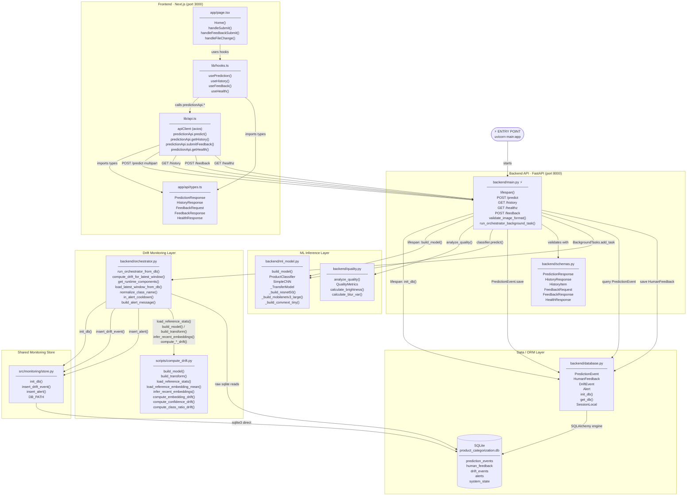

# Smart Product Categorization System

ML-powered web application that classifies product images into **beverage** or **snack** categories.

## Tech Stack

- **Frontend:** Next.js 16 (App Router), React, Tailwind CSS, TypeScript, Axios, React Query (TanStack Query)
- **Backend:** FastAPI (Python), PyTorch, safetensors, Pillow
- **Database:** SQLite with SQLAlchemy

## Code Level Architecture



### Module Summary

| Module                         | Responsibility                                                                                                                                          | Depends On                                                                  | Exposed Functions / Classes                                                                                                                     |
| ------------------------------ | ------------------------------------------------------------------------------------------------------------------------------------------------------- | --------------------------------------------------------------------------- | ----------------------------------------------------------------------------------------------------------------------------------------------- |
| **`app/page.tsx`** ⚡          | Root UI page — file upload, prediction display, feedback form, history table                                                                            | `lib/hooks.ts`, `app/api/types.ts`                                          | `Home()`                                                                                                                                        |
| **`lib/hooks.ts`**             | React Query hooks bridging UI state to API calls                                                                                                        | `lib/api.ts`, `app/api/types.ts`                                            | `usePrediction()`, `useHistory()`, `useFeedback()`, `useHealth()`                                                                               |
| **`lib/api.ts`**               | Axios client configured against FastAPI base URL; wraps all four endpoints                                                                              | `app/api/types.ts`                                                          | `apiClient`, `predictionApi.predict()`, `predictionApi.getHistory()`, `predictionApi.submitFeedback()`, `predictionApi.getHealth()`             |
| **`app/api/types.ts`**         | Shared TypeScript interfaces for all API request/response bodies                                                                                        | —                                                                           | `PredictionResponse`, `HistoryResponse`, `HistoryItem`, `FeedbackRequest`, `FeedbackResponse`, `HealthResponse`                                 |
| **`backend/main.py`** ⚡       | FastAPI app — HTTP routing, image decoding, model invocation, DB persistence, background drift trigger                                                  | `database.py`, `ml_model.py`, `quality.py`, `orchestrator.py`, `schemas.py` | `POST /predict`, `GET /history`, `GET /healthz`, `POST /feedback`                                                                               |
| **`backend/schemas.py`**       | Pydantic request/response models for automatic FastAPI validation and serialisation                                                                     | —                                                                           | `PredictionResponse`, `HistoryResponse`, `FeedbackRequest`, `FeedbackResponse`, `HealthResponse`                                                |
| **`backend/ml_model.py`**      | Model architecture definitions and `build_model()` factory (EfficientNet-B0, SimpleCNN, ResNet-50, MobileNetV3, ConvNeXt variants)                      | PyTorch, torchvision                                                        | `build_model()`, `ProductClassifier`, `SimpleCNN`, `_TransferModel`                                                                             |
| **`backend/quality.py`**       | Analyses PIL images for brightness, blur variance, and resolution; emits quality warnings                                                               | Pillow, OpenCV, NumPy                                                       | `analyze_quality()`, `QualityMetrics`                                                                                                           |
| **`backend/database.py`**      | SQLAlchemy ORM models, engine, session factory, and `init_db()` migration helper                                                                        | SQLAlchemy, SQLite                                                          | `PredictionEvent`, `HumanFeedback`, `DriftEvent`, `Alert`, `init_db()`, `get_db()`, `SessionLocal`                                              |
| **`backend/orchestrator.py`**  | Drift-check coordinator — reads new predictions from DB, delegates to `compute_drift.py`, writes drift events/alerts. Runs as a FastAPI background task | `src/monitoring/store.py`, `scripts/compute_drift.py`, SQLite               | `run_orchestrator_from_db()`                                                                                                                    |
| **`scripts/compute_drift.py`** | Stateless drift math library — decodes base64 images, extracts channel-stat embeddings, computes embedding / confidence / class-ratio drift scores      | NumPy, Pillow                                                               | `load_reference_stats()`, `infer_recent_embeddings()`, `compute_embedding_drift()`, `compute_confidence_drift()`, `compute_class_ratio_drift()` |
| **`src/monitoring/store.py`**  | Raw `sqlite3` helpers to create and write `drift_events` and `alerts` tables                                                                            | SQLite (stdlib)                                                             | `init_db()`, `insert_drift_event()`, `insert_alert()`, `DB_PATH`                                                                                |
| **SQLite DB**                  | Single-file relational store shared by both SQLAlchemy ORM and the orchestrator's direct `sqlite3` connection                                           | —                                                                           | Tables: `prediction_events`, `human_feedback`, `drift_events`, `alerts`, `system_state`                                                         |

> **Legend**: ⚡ = system entry point · internal-only functions are not listed in the table

## Frontend Architecture

The frontend uses a modern data-fetching architecture:

- **Axios** - HTTP client for API communication with interceptors and error handling
- **React Query (TanStack Query)** - Server state management with caching, automatic refetching, and optimistic updates

### Key Files

```
frontend/
├── app/
│   ├── page.tsx          # Main page component
│   ├── layout.tsx        # Root layout with providers
│   ├── providers.tsx     # React Query provider setup
│   └── api/types.ts      # TypeScript interfaces for API responses
├── lib/
│   ├── api.ts            # Axios API client and endpoints
│   └── hooks.ts          # React Query hooks (usePrediction, useHistory, useFeedback)
```

### React Query Hooks

| Hook                        | Purpose                         |
| --------------------------- | ------------------------------- |
| `usePrediction()`           | Upload image and get prediction |
| `useHistory(limit, offset)` | Fetch prediction history        |
| `useFeedback()`             | Submit human feedback           |
| `useHealth()`               | Check backend health status     |

## Quick Start

### Backend

```bash
cd backend
python3 -m venv venv
source venv/bin/activate
pip install -r requirements.txt
uvicorn main:app --host 0.0.0.0 --port 8000
```

### Frontend

```bash
cd frontend
npm install
npm run dev
```

The frontend runs at `http://localhost:3000` and proxies API requests to the backend at `http://localhost:8000`.

## API Endpoints

| Endpoint    | Method | Description                                          |
| ----------- | ------ | ---------------------------------------------------- |
| `/predict`  | POST   | Upload an image (JPG/PNG) for classification         |
| `/history`  | GET    | Get prediction history (`?limit=20&offset=0`)        |
| `/healthz`  | GET    | Health check                                         |
| `/feedback` | POST   | Submit human feedback for low-confidence predictions |

## Prediction Response

```json
{
  "predicted_class": "beverage",
  "confidence": 0.95,
  "latency_ms": 125.5,
  "low_confidence_flag": false,
  "brightness": 128.3,
  "blur_var": 45.2,
  "width": 224,
  "height": 224,
  "quality_warnings": [],
  "prediction_id": 1
}
```

## Database Schema

- **prediction_events** - Records all predictions with quality metrics
- **human_feedback** - Stores corrections for low-confidence predictions
- **drift_events** - Data drift monitoring records
- **alerts** - System alerts for administrators

## Reset Database (Development)

If you want to clear all prediction history and feedback data, reset the SQLite file.

1. Stop the backend server.
2. Remove the database file.
3. Start the backend again (tables are created automatically at startup).

```bash
rm -f backend/product_categorization.db
```

Then run backend again:

```bash
cd backend
uvicorn main:app --host 0.0.0.0 --port 8000 --log-level info
```

Notes:

- This permanently deletes all local data in all tables.
- This is intended for local development only.

## Model

The system uses EfficientNet-B0 for product classification with 2 classes: `beverage` and `snack`.
